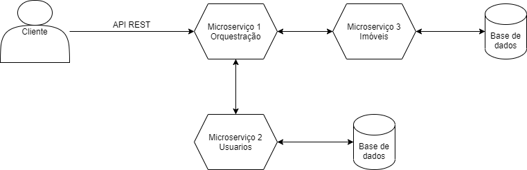
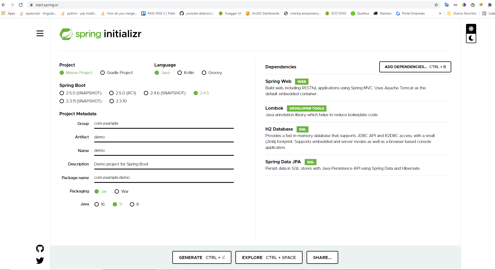
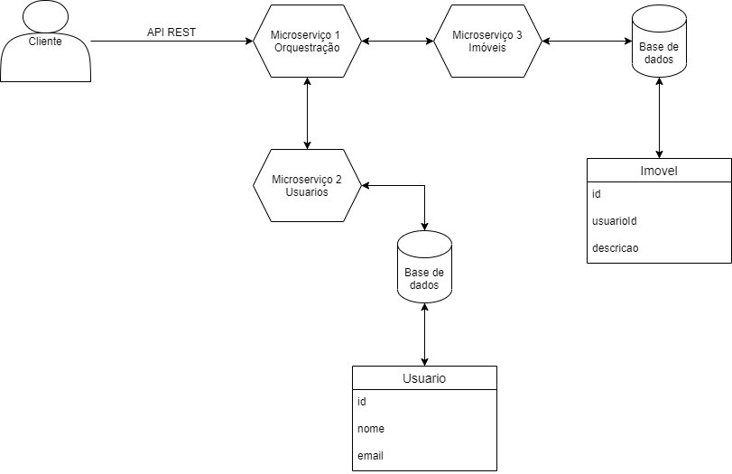
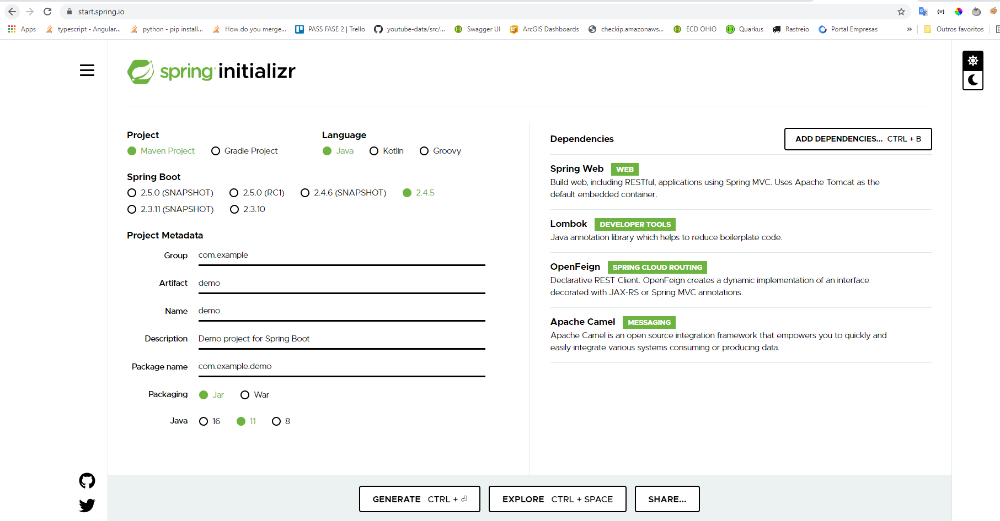
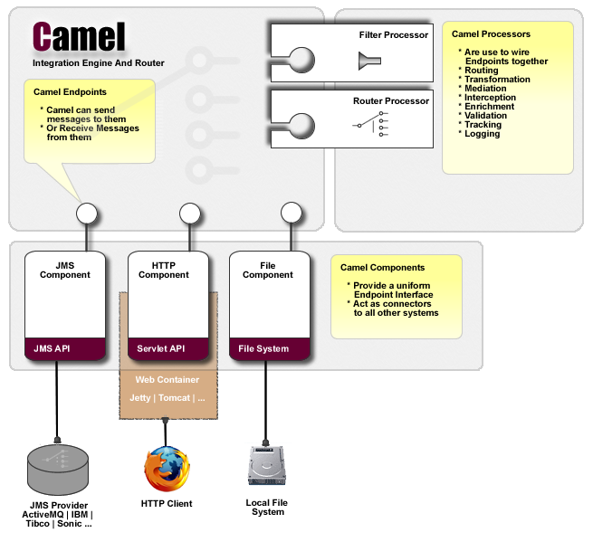

# Microsserviços utilizando o Apache Camel e o FeignClient

Fala galera, hoje eu gostaria de falar um pouco sobre microsserviços. Usaremos duas ferramentas muito legais. Primeiro, é importante que antes que você leia esse artigo você já tenha conhecimento prévio em Spring para que você consiga entender perfeitamente o que estou escrevendo.

Primeiro veja esse desenho:



A ideia aqui é criar dois microsserviços simples que acessam uma base de dados em memória. Para ambos os projetos utilizei as seguintes libs no spring boot start:



Dois projetos simples que um retorna dados de Usuário e o outro dados de imóveis:

Nas seguintes tabelas:



Cada um desses microserviços expõe um endpoint simples para retornar uma lista dos dados de cada um deles. Cada microserviço apontando para uma porta específica para conseguirmos subir os dois juntos.

Não vou colocar o código aqui no artigo, porém você pode consultar no meu repo do github:

https://github.com/natanielpaiva/integracao-camel

Agora vamos para a parte do Camel que vou colocar as seguintes libs no microsserviço de orquestração:



O pom vai ficar da seguinte forma:

```xml
<?xml version="1.0" encoding="UTF-8"?>
<project xmlns="http://maven.apache.org/POM/4.0.0" xmlns:xsi="http://www.w3.org/2001/XMLSchema-instance"
         xsi:schemaLocation="http://maven.apache.org/POM/4.0.0 https://maven.apache.org/xsd/maven-4.0.0.xsd">
    <modelVersion>4.0.0</modelVersion>
    <parent>
        <groupId>org.springframework.boot</groupId>
        <artifactId>spring-boot-starter-parent</artifactId>
        <version>2.4.5</version>
        <relativePath/> <!-- lookup parent from repository -->
    </parent>
    <groupId>exemplo.ms1</groupId>
    <artifactId>orch</artifactId>
    <version>0.0.1-SNAPSHOT</version>
    <name>orch</name>
    <description>Microserviço responsável pela orquestração</description>
    <properties>
        <java.version>11</java.version>
        <spring-cloud.version>2020.0.2</spring-cloud.version>
    </properties>
    <dependencies>
        <dependency>
            <groupId>org.springframework.boot</groupId>
            <artifactId>spring-boot-starter-web</artifactId>
        </dependency>
        <dependency>
            <groupId>org.apache.camel.springboot</groupId>
            <artifactId>camel-spring-boot-starter</artifactId>
            <version>3.9.0</version>
        </dependency>
        <dependency>
            <groupId>org.springframework.cloud</groupId>
            <artifactId>spring-cloud-starter-openfeign</artifactId>
        </dependency>

        <dependency>
            <groupId>org.projectlombok</groupId>
            <artifactId>lombok</artifactId>
            <optional>true</optional>
        </dependency>
        <dependency>
            <groupId>org.springframework.boot</groupId>
            <artifactId>spring-boot-starter-test</artifactId>
            <scope>test</scope>
        </dependency>
    </dependencies>

    <dependencyManagement>
        <dependencies>
            <dependency>
                <groupId>org.springframework.cloud</groupId>
                <artifactId>spring-cloud-dependencies</artifactId>
                <version>${spring-cloud.version}</version>
                <type>pom</type>
                <scope>import</scope>
            </dependency>
        </dependencies>
    </dependencyManagement>

    <build>
        <plugins>
            <plugin>
                <groupId>org.springframework.boot</groupId>
                <artifactId>spring-boot-maven-plugin</artifactId>
                <configuration>
                    <excludes>
                        <exclude>
                            <groupId>org.projectlombok</groupId>
                            <artifactId>lombok</artifactId>
                        </exclude>
                    </excludes>
                </configuration>
            </plugin>
        </plugins>
    </build>

</project>
```

É importante entender que as requisições serão feitas via FeignClient, uma das classes para acessar o microsserviço de Usuário é a UsuarioRepository:

```java
package exemplo.ms1.orch.repository;

import exemplo.ms1.orch.repository.response.UsuarioResponse;
import org.springframework.cloud.openfeign.FeignClient;
import org.springframework.web.bind.annotation.RequestMapping;
import org.springframework.web.bind.annotation.RequestMethod;

import java.util.List;

@FeignClient(name = "usuario", url = "http://localhost:9090/usuario")
public interface UsuarioRepository {
    @RequestMapping(method = RequestMethod.GET, value = "/")
    List<UsuarioResponse> retornaUsuarios();
}
```

Também vamos criar uma controller para acessar um endpoint específico do nosso orquestrador:

```java
package exemplo.ms1.orch.controller;

import exemplo.ms1.orch.repository.response.UsuarioResponse;
import exemplo.ms1.orch.service.UsuarioService;
import org.springframework.beans.factory.annotation.Autowired;
import org.springframework.web.bind.annotation.GetMapping;
import org.springframework.web.bind.annotation.RequestMapping;
import org.springframework.web.bind.annotation.RestController;

import java.util.List;

@RestController
@RequestMapping("exemplo")
public class ExemploController {

    @Autowired
    UsuarioService usuarioService;

    @GetMapping
    public List<UsuarioResponse> getUser(){
        return usuarioService.listaUsuarios();
    }

}
```

Repare que a nossa controller usa um método da UsuarioService:

```java
package exemplo.ms1.orch.service;

import exemplo.ms1.orch.camel.ExemploCamelRouter;
import org.apache.camel.ProducerTemplate;
import org.springframework.beans.factory.annotation.Autowired;
import org.springframework.stereotype.Service;

import java.util.List;

@Service
public class UsuarioService {

    @Autowired
    private ProducerTemplate template;

    public List listaUsuarios(){
        return template.requestBody(ExemploCamelRouter.USUARIO, null, List.class);
    }

}
```

O nosso UsuarioService apenas chama uma rota do Camel, essa rota vai gerenciar as chamadas que precisamos fazer para os ms2 e ms3. Veja como está de fato a rota:

```java
package exemplo.ms1.orch.camel;

import exemplo.ms1.orch.repository.ImovelRepository;
import exemplo.ms1.orch.repository.UsuarioRepository;
import feign.FeignException;
import org.apache.camel.builder.RouteBuilder;
import org.springframework.beans.factory.annotation.Autowired;
import org.springframework.stereotype.Component;

@Component
public class ExemploCamelRouter extends RouteBuilder {

    public static final String USUARIO = "direct:usuario";
    public static final String IMOVEL = "direct:imovel";
    public static final String USUARIOCAIU = "direct:usuarioCaiu";

    @Autowired
    UsuarioRepository usuarioRepository;

    @Autowired
    ImovelRepository imovelRepository;

    @Override
    public void configure() throws Exception {
        this.configExceptions();
        this.acessarEndpointComOpenFeignClient();
        this.imovel();
        this.usuarioCaiu();
    }

    private void configExceptions() {
        onException(FeignException.class)
                .maximumRedeliveries(2)
                .to(ExemploCamelRouter.USUARIOCAIU)
                .process(new ThrowExceptionProcessor())
                .end();
    }

    private void usuarioCaiu(){
        from(ExemploCamelRouter.USUARIOCAIU)
                .log("----> ${body}")
                .process(new ThrowExceptionProcessor())
                .log("error ->${body}")
                .end();
    }

    private void acessarEndpointComOpenFeignClient() {
        from(ExemploCamelRouter.USUARIO)
                .bean(usuarioRepository, "retornaUsuarios()")
                .log("----> ${body}")
                .process(new UsuarioProcessor())
                .log("->${body}")
                .to(ExemploCamelRouter.IMOVEL)
                .process(new ImovelProcessor())
                .log("->imovel")
                .end();
    }

    private void imovel(){
        from(ExemploCamelRouter.IMOVEL)
                .bean(imovelRepository, "retornaImovel()")
                .log("----> Imovel ${body}")
                .log("->${body}")
                .end();
    }

}
```

Repare que nas chamadas que fazemos tanto para o UsuarioRepository(chamando o microsserviço específico) quanto para o ImovelRepository, nós também chamamos um processor. Esse processor serve para tratarmos aquele objeto que recebemos e transformar ele na saída que de fato desejamos, veja como está o ImovelProcessor:

```java
package exemplo.ms1.orch.camel;

import exemplo.ms1.orch.repository.response.ImovelResponse;
import exemplo.ms1.orch.repository.response.UsuarioResponse;
import org.apache.camel.Exchange;
import org.apache.camel.Processor;

import java.util.List;
import java.util.stream.Collectors;

public class ImovelProcessor implements Processor {

    @Override
    public void process(Exchange exchange) {
        List<UsuarioResponse> body = exchange.getProperty("usuario", List.class);
        List<ImovelResponse> imoveis = exchange.getIn().getBody(List.class);
        body.forEach(usuarioResponse -> {
            usuarioResponse.setImoveis(imoveis.stream()
                    .filter(imovelResponse -> imovelResponse.getUsuarioId().equals(usuarioResponse.getId()))
                    .collect(Collectors.toList()));
        });
        exchange.setProperty("imovel", body);
        exchange.getIn().setBody(body);
    }

}
```

Esse é um exemplo bem simples utilizando o Apache Camel e o FeignClient, porém era possível sim o uso apenas do Camel. Dê uma olhada como é a arquitetura do Camel:



Basta rodar os três projetos juntos(já estão configurados com portas diferentes) e pronto você vai ver a seguinte tela acessando o endereço http://localhost:8080/exemplo

Veja que nesse endpoint estamos trazendo tanto os dados de usuários quanto os imóveis atrelados a cada usuário. Lembrando que esse é apenas um exemplo simples, sugiro que baixe o código e comece a brincar e treinar e treinar. Espero ter ajudado alguém! Abraços galera e até a próxima.


